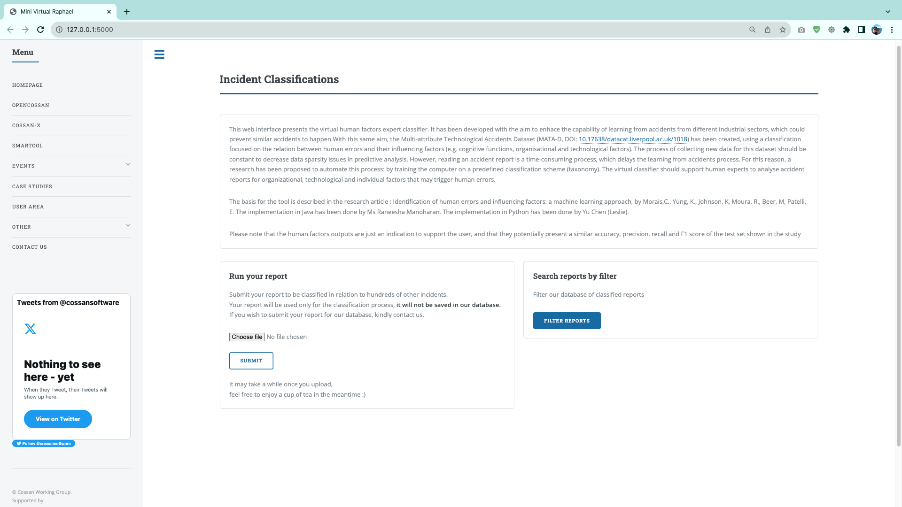

Virtual Raphael
==============================

Human error classifier based on MATA-D and Machine Learning algorithm.

## *highlights*

- [x] Based on the Google BERT model;


## web application

An intuitive web application[^1] is created for facilitating the use of `Virtual Raphael`. 




## command line interface

The application can be easily run from terminal, after [installing the package locally](#installation). Put your PDF file into the directory `inference_reports/New Report` and call the CLI command as below. Currently, running a cycle of all the models takes about 3 mins.

```shell
$ virtual_raphael
```
The results and visualisations will be saved into the `Predictions` directory. 


## installation

Pre-traioned models should be downloaded separately and then put into a directory named `models`. Refer to [caveats](#caveats).

First install by:

```shell
pip install .
```


### reference


### caveats

Pre-trained models are of size **23.21GB**, which can be downloaded [here](https://strath-my.sharepoint.com/personal/karl_johnson_strath_ac_uk/_layouts/15/onedrive.aspx?ga=1&id=%2Fpersonal%2Fkarl%5Fjohnson%5Fstrath%5Fac%5Fuk%2FDocuments%2FDocuments%2FVirtual%20Raphael%2FVirtual%20Raphael%20Package%2FModels).


--------

<p><small>Project based on the <a target="_blank" href="https://drivendata.github.io/cookiecutter-data-science/">cookiecutter data science project template</a>. #cookiecutterdatascience</small></p>

[^1]: Created by [Yu Chen](https://yuchenakaleslie.github.io/) with Flask;